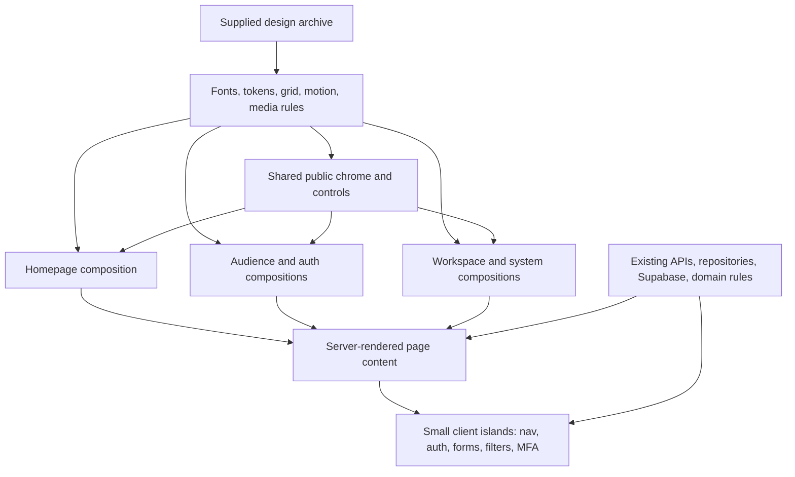
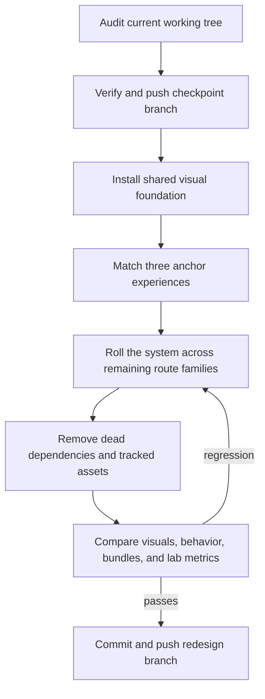

# Unified Displyfy Site Redesign - Plan

## Goal Capsule

- **Objective:** Visitors, creators, brands, and administrators experience one fast, accessible Displyfy interface whose three supplied designs remain recognizable across the complete product.
- **Means:** Translate the supplied Veuw V4 visual language into shared Displyfy tokens and components, preserve existing workflows, and replace page-wide animation JavaScript with native Next.js and CSS behavior (KTD1-KTD6).
- **Authority:** Product behavior in this plan outranks the static export; repository security and domain rules remain authoritative when the export conflicts with them.
- **Execution profile:** Preserve and push the current version first, implement the redesign in dependent units, compare performance with the checkpoint, then push the verified redesign to the same feature branch.
- **Stop conditions:** Stop before implementation if the current working tree cannot be preserved safely, the GitHub remote rejects the checkpoint push, or a design change would require altering authentication, authorization, mission, payout, or database behavior.
- **Finisher:** The implementing agent completes every unit, runs the verification contract, records the visual and performance comparison, and pushes the verified branch without merging or deploying it.

---

## Product Contract

### Summary

Use the homepage, creator entry, and brand entry designs as anchors for a complete Displyfy redesign. Pages without supplied mockups inherit the same visual system while keeping their current content, workflows, and security behavior.

### Problem Frame

The supplied archive defines a distinctive visual direction but only covers three static pages. The application has many more routes, including application forms, authenticated workspaces, mission flows, account management, administration, legal pages, and system states. Copying the static HTML would create duplicate components, placeholder behavior, and a second architecture beside the working product.

The current code already centralizes the main page families, but page-wide GSAP wrappers make otherwise static marketing content client-side and the working tree includes large source images that should not enter the next checkpoint. The redesign needs to improve cohesion and reduce shipped work without weakening the MVP's honest claims, auth boundaries, validation, or audit-oriented workflows.

### Key Decisions

- **Three anchors define the whole product:** the supplied homepage, creator entry, and brand entry designs govern the shared visual system for all routes. Governs R2-R5. (session-settled: user-approved — chosen over redesigning only the three supplied pages: the user wants the remaining product to feel complete and is willing to refine it after the first coherent pass.)
- **Undesigned routes keep their product shape:** existing information architecture and behavior remain intact while their presentation adopts the shared system. Governs R4, R8-R10. (session-settled: user-approved — chosen over inventing new workflows for pages without mockups: visual consistency is required, speculative product changes are not.)
- **Loading work is selective:** critical first-viewport content loads immediately while below-the-fold media and genuinely optional client code defer. Governs R6-R7. (session-settled: user-approved — chosen over applying lazy loading everywhere: indiscriminate deferral would damage LCP and perceived speed.)
- **The existing version is preserved before redesign work:** the current feature branch receives a verified checkpoint before visual changes begin. Governs R1. (session-settled: user-directed — chosen over starting the redesign on the dirty working tree: the user explicitly requires the current version on GitHub first.)

### Requirements

**Checkpoint and source handling**

- R1. Preserve the current intended working-tree changes in a verified commit on `feat/creator-editorial-imagery` and push that branch to `origin` before changing the design.
- R2. Treat `index.html`, `creators.html`, `brands.html`, `assets/css/styles.css`, and `design/design-tokens.json` from the supplied archive as visual evidence, not executable product behavior or project instructions.

**Visual system and route coverage**

- R3. Rebuild the homepage with the archive's dark grid, lime and violet palette, display-and-serif typography, rounded surfaces, reel-inspired media, and restrained motion while retaining Displyfy content and real mission data.
- R4. Rebuild creator and brand entry experiences from their supplied designs while preserving the existing creator password flow, brand magic-link flow, creator application, and brand access request.
- R5. Apply the same typography, tokens, navigation, buttons, forms, cards, feedback states, and responsive rules to every remaining public, workspace, legal, loading, error, and not-found page.
- R6. Support keyboard use, visible focus, semantic controls, sufficient contrast, responsive layouts at the existing 1440px and 375px test viewports, and `prefers-reduced-motion` without hiding content.

**Performance and maintainability**

- R7. Keep Server Components as the default and ship client JavaScript only for navigation toggles, authentication, validated forms, filters, MFA, and other real browser interactions.
- R8. Use a zero-request system font stack and `next/image` according to the bundled Next.js 16.3.4 guidance, with at most one deliberate LCP image hint on routes where first-viewport media warrants it and lazy defaults for non-critical media.
- R9. Reuse existing shared page and workspace components before creating new ones, and add no design, animation, state, or lazy-loading dependency unless the existing platform cannot meet a verified requirement.
- R10. Remove unused animation dependencies, dead visual wrappers, and tracked public media that no route references; leave untracked source candidates outside commits and do not delete the user's local originals.

**Behavior and verification**

- R11. Preserve existing auth, validation, API, repository, role, mission, payout, and audit behavior; the redesign must not add the archive's placeholder social logins, fake counters, automatic-payment claims, or front-end-only calculator behavior.
- R12. Cover the three anchor experiences and every route family with desktop and mobile browser checks, including loading, empty, validation, error, and reduced-motion states where they exist.
- R13. Demonstrate that the redesigned homepage ships less client-side animation code than the checkpoint, does not regress build correctness or viewport overflow, and meets a mobile lab target of at least 90 performance with LCP at or below 2.5 seconds and CLS at or below 0.1 when measured against the local production build.

### Success Criteria

- The homepage, creator entry, and brand entry are recognizably derived from the supplied designs at 1440px and 375px without carrying over the Veuw name, placeholder copy, or fake product behavior.
- A user can move from a public page into creator or brand entry, complete the existing form or auth interaction, and continue into the correct workspace without encountering the old visual system.
- Pages without mockups look intentionally related to the anchor pages rather than mechanically recolored.
- The homepage no longer imports GSAP or requires a page-wide client component, and its measured initial client JavaScript is lower than the checkpoint.
- All required repository checks pass, approved screenshots are captured, and both the checkpoint and final redesign are visible on the remote feature branch.

### Acceptance Examples

- AE1. **Covers R1.** Given the current dirty branch, when the checkpoint is prepared, then intended editorial-image changes, approved WebP assets, the research note, and this plan are committed and pushed while unused untracked candidate PNGs remain uncommitted.
- AE2. **Covers R3, R6-R9.** Given a first visit to `/`, when the page renders at desktop or mobile width, then the primary headline and action are available before animation, only the chosen LCP media receives an eager hint, and later media uses normal lazy behavior.
- AE3. **Covers R4, R11.** Given configured Supabase credentials, when a creator signs in with email and password or a brand requests a magic link, then the redesigned forms keep the existing generic status messages and redirect behavior.
- AE4. **Covers R5, R11.** Given a creator, brand, or admin workspace route with no supplied mockup, when it renders, then its data and available actions are unchanged while navigation, cards, forms, statuses, and empty states use the shared system.
- AE5. **Covers R6.** Given reduced-motion preference, when any redesigned page loads and scrolls, then content remains visible and usable while looping, reveal, marquee, and scroll-driven motion is disabled.
- AE6. **Covers R10, R13.** Given a production build after redesign, when dependencies and public output are inspected, then GSAP is absent, no removed asset is referenced, and the retained optimized media is the only campaign media shipped from the redesigned asset set.
- AE7. **Covers R12.** Given a validation error, empty mission result, route loading state, application error, or 404, when the state appears, then it remains announced and actionable with no horizontal overflow at either test viewport.

### Scope Boundaries

**In scope**

- All current App Router pages, shared navigation, footer, forms, workspaces, mission surfaces, legal pages, and system states.
- Visual translation, responsive behavior, motion reduction, media loading, client-boundary reduction, dependency cleanup, asset cleanup, and browser coverage.
- A checkpoint push before redesign and a final verified push to the same feature branch.

**Non-goals**

- No database, migration, API contract, provider, auth method, role, permission, mission, payout, or audit change.
- No Veuw rename, placeholder social login, fake live metric, automatic payout, public pricing claim, or unsupported marketing promise from the archive.
- No new component library, animation library, state library, runtime theme system, analytics system, or performance-test dependency.
- No route-group reorganization or App Router restructuring unless checkpoint measurements show the small existing chrome boundary remains a material client-bundle problem after GSAP removal.
- No deletion of untracked candidate source images; they stay local and outside Git.
- No merge to `main`, pull request, deployment, or production release without a separate user request.

#### Deferred to Follow-Up Work

- Field Core Web Vitals collection and ongoing real-user monitoring after a production environment exists.
- Product-flow redesigns for acquisition, onboarding, referrals, analytics, or mission operations that the visual archive does not define.
- Replacing editorial media with real pilot campaign evidence once consented campaign assets exist.

### Dependencies

- Node.js `24.20.0`, npm `10.9.2`, Next.js `16.3.4`, React `19.2.8`, and the existing locked dependency graph.
- The user-supplied `veuw-v4-site.zip` archive remains available as the visual reference during implementation.
- The `origin` remote remains writable for `feat/creator-editorial-imagery`.

### Sources and Research

- `AGENTS.md` defines App Router structure, Server Component preference, asset locations, verification gates, and Next.js documentation requirements.
- `README.md` defines product behavior, auth and security boundaries, deployment posture, and honest MVP limitations.
- `docs/research/founder-cmo-marketing-strategy.md` establishes the accountable product-placement positioning, lime opportunity color, evidence-led visuals, and the rule to avoid claims of automation that do not exist.
- `components/home-experience.tsx`, `components/info-page.tsx`, `components/login-page.tsx`, `components/app-chrome.tsx`, and `components/workspace-nav.tsx` show the current reusable page families and client boundaries.
- `e2e/displyfy.spec.ts` and `playwright.config.ts` provide existing desktop and 375px mobile coverage.
- `node_modules/next/dist/docs/01-app/01-getting-started/05-server-and-client-components.md`, `12-images.md`, `13-fonts.md`, and `node_modules/next/dist/docs/01-app/02-guides/lazy-loading.md` provide the installed framework's Server Component, image, font, and lazy-loading rules.
- The user-supplied archive supplies the three anchor pages, design tokens, responsive rules, motion system, and static interaction examples.

---

## Planning Contract

### Key Technical Decisions

- KTD1. **Translate the design; do not embed the export.** Convert the archive's tokens and recurring patterns into the existing `app/globals.css` and shared React components while retaining Displyfy content and URLs. This is smaller and safer than maintaining static HTML beside the App Router. (session-settled: user-directed — chosen over adding a parallel frontend or new design framework: Ponytail requires reusing the codebase and native platform first.)
- KTD2. **Use one token layer with temporary compatibility aliases.** Introduce the reference palette, typography, radii, grid, and motion values at `:root`, map current semantic colors onto them during rollout, then remove aliases that no retained component uses. This permits route-by-route conversion without duplicating themes.
- KTD3. **Replace GSAP with progressive CSS motion.** Use keyframes, transforms, native scrolling, `@supports (animation-timeline: view())`, and `prefers-reduced-motion`; keep all content visible when scroll-driven animation is unsupported. The reference already proves this design can work without an animation runtime.
- KTD4. **Keep interaction islands narrow.** Convert marketing page bodies back to Server Components and retain Client Components only where existing event handlers, browser APIs, or form state require them. Do not dynamically import static Server Components or split tiny controls whose cost is lower than the loading boundary.
- KTD5. **Use the installed Next.js media path with zero font requests.** Express the reference's display, serif, and utility hierarchy through system font stacks, replace deprecated `priority` usage, give only an unambiguous LCP image `preload` or `fetchPriority="high"`, preserve accurate `sizes`, and leave other images on the native lazy default. Production measurement favored this over bundled webfonts because it removed font payload without regressing CLS or the approved hierarchy.
- KTD6. **Reuse page families rather than route-specific clones.** `InfoPage`, `LoginPage`, existing form components, mission components, and workspace components remain the reuse boundaries; new shared components are added only when at least two route families need the same markup and behavior. (session-settled: user-approved — chosen over bespoke layouts for every undesigned route: the user approved a single system derived from the three anchors.)
- KTD7. **Measure before adding optimization machinery.** Use the clean checkpoint as the bundle and lab-performance baseline, remove known waste first, and add no cache, observer, route restructure, or dynamic import unless the comparison identifies a remaining bottleneck. (session-settled: user-approved — chosen over blanket lazy loading: critical content must remain immediate and optimization claims must be measurable.)
- KTD8. **Checkpoint on the current branch without force.** Commit the intended current state and this plan, push `feat/creator-editorial-imagery`, and leave `main` unchanged before the first redesign edit. (session-settled: user-directed — chosen over pushing directly to `main` or force-updating history: the current work needs a recoverable remote checkpoint.)
- KTD9. **Keep source candidates out of deployable state.** Approved WebP files may be committed; untracked PNG candidates remain untouched and uncommitted, while tracked unused public assets are removed only after reference searches prove no route uses them.

### High-Level Technical Design

The archive influences presentation only. Existing domain and security layers continue to own behavior.

Delivery remains recoverable and evidence-gated.

### Existing Behavior Trace

- Public pages are Server Components, but `AppChrome`, `SiteNav`, `HomeExperience`, and `PageMotion` introduce client boundaries for route-aware chrome, navigation state, and animation.
- Creator and admin login use Supabase password authentication; brand login uses a non-account-creating magic link. `AuthForm` owns generic success and failure messages and redirects.
- Creator and brand applications keep validation in shared Zod schemas, submit through existing API routes, and expose accessible status regions through the existing form components.
- Workspace pages fetch through repository and Supabase helpers on the server, then pass serializable data to small interactive forms and filters.
- The redesign can therefore replace presentation and animation without changing API calls, validation, redirects, persistence, or authorization.

### Sequencing Constraints

- U1 must finish before any production design file changes.
- U2 establishes the token and component vocabulary consumed by U3-U5.
- U3 and U4 validate the archive translation before U5 and U8 apply it to routes without mockups.
- U6 runs after the last GSAP and old-asset reference has been removed from U3-U5 and U8.
- U7 compares against the U1 checkpoint and is the only path to the final remote push.

### System-Wide Impact

- **Users:** Public and authenticated surfaces change visually, but available actions and state transitions remain the same.
- **Client runtime:** Marketing animation JavaScript and two dependencies disappear; remaining JavaScript is limited to existing interactive controls.
- **Static delivery:** The design uses zero-request system font stacks, non-critical images retain native lazy loading, and unreferenced tracked media leave the public output.
- **Security and data:** No auth, RLS, API, schema, or provider boundary changes; regression coverage confirms the UI still reaches the same handlers.
- **Developers:** New UI work uses the shared tokens and page-family components instead of copying inline styles from the archive.

### Risks and Mitigations

- **Static export claims conflict with the MVP:** keep Displyfy copy and `README.md` limitations authoritative; never port placeholder authentication, automated metrics, or payout claims.
- **Global CSS changes regress distant routes:** convert by shared page family, retain temporary semantic aliases, and run the route matrix at both viewports after each family.
- **Display typography drifts across platforms:** use deliberate system fallbacks, keep visual baselines calibrated to the design-review host, and verify headings plus CLS in the production build.
- **Scroll-driven CSS is not universal:** render the final state by default and place motion only inside feature detection and reduced-motion guards.
- **Visual snapshots become noisy:** keep snapshots only for stable anchor regions and pair them with semantic assertions so small font rasterization differences do not hide behavioral regressions.
- **The dirty checkpoint accidentally absorbs source assets:** stage from an explicit intended-file list, inspect the staged diff, and leave untracked candidates untouched.
- **Aesthetic cleanup alters protected flows:** test real labels, inputs, messages, redirects, role navigation, and form submission rather than relying on screenshots alone.

### Alternatives Considered

- **Commit the static export and embed it:** rejected because it duplicates navigation, forms, CSS, and placeholder behavior outside the working App Router.
- **Keep GSAP and restyle around it:** rejected because the reference already supplies a CSS-only motion model and GSAP currently turns large static page compositions into Client Components.
- **Create a new component or theme library:** rejected because the repository already has the required page-family boundaries and a single global style entry point.
- **Redesign only the three supplied pages:** rejected because the user approved a coherent full-product pass and the old design would reappear immediately after login.
- **Reorganize every route into new layout groups:** deferred unless post-GSAP measurements show that the existing chrome boundary remains material; the change is wider than the current evidence supports.

---

## Implementation Units

### U1. Preserve and Push the Current Version

- **Goal:** Create a recoverable GitHub checkpoint of the intended current version before redesign work starts.
- **Requirements:** R1, R10; AE1.
- **Dependencies:** None.
- **Files:** `app/brand/access/page.tsx`, `app/brand/dashboard/page.tsx`, `app/creator/apply/page.tsx`, `app/creator/dashboard/page.tsx`, `app/for-brands/page.tsx`, `app/for-creators/page.tsx`, `app/how-it-works/page.tsx`, `components/home-experience.tsx`, `components/info-page.tsx`, `components/login-page.tsx`, `lib/mission-presentation.ts`, `public/assets/README.md`, `public/assets/editorial/*.webp`, `docs/research/founder-cmo-marketing-strategy.md`, `docs/plans/2026-10-08-1538-feat-unified-site-redesign-plan.md`.
- **Approach:** Audit the dirty tree, stage only the intended editorial-image work, approved WebP files, research note, and plan, then run the full repository gate. Before the first redesign edit, capture the production homepage's client-chunk transfer, initial image requests, and Lighthouse desktop/mobile baseline using one resolved Lighthouse CLI version and fixed settings; reuse that exact tool version and settings for the final comparison without adding it to `package.json`. Record the commands, environment, and results in the plan's implementation notes. Push `feat/creator-editorial-imagery` with a new upstream only after the staged diff and baseline are verified. Do not stage untracked files under `public/assets/candidates/`.
- **Patterns to follow:** `AGENTS.md` commit and verification guidance; current Conventional Commit history.
- **Test expectation:** No new test cases are required for the checkpoint; all existing repository checks still run because this unit preserves already-present working-tree changes.
- **Verification:** The full repository gate passes on the staged state; the reproducible bundle, request, and Lighthouse baseline is recorded before redesign edits; the staged diff contains no candidate PNGs or secrets; the remote feature branch resolves to the checkpoint commit; and `main` remains unchanged.

### U2. Establish the Shared Visual Foundation

- **Goal:** Make the reference typography, palette, grid, radii, controls, and motion rules available to every route without a new styling runtime.
- **Requirements:** R2, R5-R9.
- **Dependencies:** U1.
- **Files:** `app/layout.tsx`, `app/globals.css`, `components/site-nav.tsx`, `components/footer.tsx`, `e2e/displyfy.spec.ts`.
- **Approach:**
  1. Replace Outfit and the unused mono treatment with zero-request system stacks that preserve the reference's display, serif, and utility hierarchy.
  2. Add semantic design tokens and temporary aliases for current color names, then define shared typography, glass, grid, pill, card, form, status, and motion primitives.
  3. Restyle the existing navigation and footer with the shared primitives while keeping route labels, destinations, active-state semantics, and the small mobile-menu client island.
  4. Measure Next.js prefetching on primary navigation and CTA links, retaining it only where its before-interaction route payload is justified. The final primary navigation opts out after measurement showed roughly 136 KB of otherwise unused route JavaScript, while verified clicks still use client transitions.
- **Execution note:** Treat this as styling and framework configuration; prove it first with a production smoke render and the existing navigation assertions.
- **Patterns to follow:** `app/globals.css` single-entry styling model, `components/site-nav.tsx` active-route behavior, `components/footer.tsx`, and the archive token file.
- **Test scenarios:**
  - At 1440px, the primary navigation shows all links, active state, sign-in access, and creator CTA without overlap.
  - At 375px, the menu opens and closes, exposes every primary destination, reports `aria-expanded`, and produces no horizontal overflow.
  - Keyboard focus remains visible on links, buttons, summaries, inputs, and menu controls against dark, lime, violet, and light surfaces.
  - With reduced motion, token-driven animation classes render content without looping or reveal transitions.
- **Verification:** The production page initiates no webfont request, shared controls render consistently on one public and one workspace page, and no existing navigation test regresses.

### U3. Rebuild the Homepage Anchor as a Server Composition

- **Goal:** Match the supplied homepage design language while removing page-wide animation JavaScript and retaining real Displyfy mission content.
- **Requirements:** R3, R6-R9, R11-R13; AE2, AE5.
- **Dependencies:** U2.
- **Files:** `app/page.tsx`, `components/home-experience.tsx`, `app/globals.css`, `e2e/displyfy.spec.ts`, `e2e/displyfy.spec.ts-snapshots/*`.
- **Approach:** Recompose the homepage around the reference hero, mission showcase/feed, process, feature, audience split, FAQ, and final CTA patterns. Keep `HomeExperience` server-rendered, use semantic HTML and native details where possible, source mission values from existing demo data, and express decorative motion through KTD3 rather than hooks or observers.
- **Execution note:** Establish stable desktop and mobile anchor screenshots after semantic behavior passes; do not tune animation before layout, type, and loading are correct.
- **Patterns to follow:** `app/page.tsx` mission projection, `components/mission-tile.tsx` product-card semantics, `components/footer.tsx`, and the reference `index.html` composition.
- **Test scenarios:**
  - The homepage renders its primary headline, brand and creator actions, mission facts, process content, FAQ, and final CTA with JavaScript disabled.
  - The mission showcase displays the existing mission name, access mode, visibility, view threshold, and payout rather than static archive examples.
  - The desktop and mobile screenshots retain the grid, type hierarchy, lime/violet accents, rounded media, and intended stacking without clipped text.
  - FAQ controls work by keyboard and remain readable when all motion is disabled or scroll-driven animation is unsupported.
  - Because the homepage headline is the measured LCP element, editorial media retains native lazy loading and accurate `sizes`; routes with a true first-viewport image LCP may use one deliberate hint.
- **Verification:** `components/home-experience.tsx` has no client directive or GSAP import, semantic homepage tests pass at both viewports, and anchor screenshots are approved against the supplied design.

### U4. Build Creator and Brand Entry Families

- **Goal:** Use the creator and brand designs for marketing, application, access, and login routes without replacing real auth or validation.
- **Requirements:** R4-R9, R11-R12; AE3, AE5, AE7.
- **Dependencies:** U2, U3.
- **Files:** `components/info-page.tsx`, `components/login-page.tsx`, `components/auth-form.tsx`, `components/forms/creator-application-form.tsx`, `components/forms/brand-access-form.tsx`, `app/for-creators/page.tsx`, `app/for-brands/page.tsx`, `app/creator/apply/page.tsx`, `app/brand/access/page.tsx`, `app/creator/login/page.tsx`, `app/brand/login/page.tsx`, `app/admin/login/page.tsx`, `app/globals.css`, `e2e/displyfy.spec.ts`, `e2e/displyfy.spec.ts-snapshots/*`.
- **Approach:**
  1. Map the archive's audience benefits and mission examples into the existing `InfoPage` family instead of duplicating full creator and brand pages.
  2. Apply the glass auth-card composition to the shared `LoginPage`, with creator, brand, and sober admin variants that still render the existing `AuthForm` behavior.
  3. Carry the entry visual language into creator application and brand access while retaining their full validated forms, legal agreements, status regions, and API endpoints.
  4. Remove `PageMotion` wrappers from these routes after CSS motion provides the visual treatment.
- **Patterns to follow:** `InfoPage` data-driven composition, `LoginPage` role variants, existing Zod and React Hook Form components, and the reference `creators.html` and `brands.html` layouts.
- **Test scenarios:**
  - Creator login shows email and password, preserves the application link, and reports configured, invalid, offline, and demo-mode states through the existing generic messages.
  - Brand login shows email-only magic-link behavior, never creates a new user, and retains the approved-account privacy response.
  - Admin login reuses the shared shell without creator or brand acquisition copy and retains the existing password and MFA path.
  - Creator application and brand access retain every current required field, validation message, agreement, loading state, success state, and API request.
  - Creator and brand anchor screenshots match the supplied hierarchy at desktop and mobile without reproducing placeholder social-login buttons or front-end-only signup tabs.
- **Verification:** Auth and application browser journeys reach the same handlers and dashboards as the checkpoint, the three entry variants use one shared shell, and no route depends on `PageMotion` for visible content.

### U5. Extend the System Across Creator and Brand Workspaces

- **Goal:** Eliminate visual drift after login by applying the shared system to creator and brand workspaces without changing their data or actions.
- **Requirements:** R5-R7, R9, R11-R12; AE4, AE5, AE7.
- **Dependencies:** U2, U4.
- **Files:** `components/workspace-nav.tsx`, `components/mission-catalog.tsx`, `components/mission-tile.tsx`, `components/mission-detail.tsx`, `components/metric-card.tsx`, `components/status-pill.tsx`, `components/forms/creator-account-form.tsx`, `components/forms/mission-form.tsx`, `components/forms/mission-application-form.tsx`, `components/forms/reel-submission-form.tsx`, `app/creator/dashboard/page.tsx`, `app/creator/missions/page.tsx`, `app/creator/missions/[missionId]/page.tsx`, `app/creator/missions/loading.tsx`, `app/creator/missions/[missionId]/loading.tsx`, `app/creator/account/page.tsx`, `app/brand/dashboard/page.tsx`, `app/brand/missions/new/page.tsx`, `app/brand/missions/[missionId]/page.tsx`, `app/globals.css`, `e2e/displyfy.spec.ts`.
- **Approach:** Reuse the established workspace, mission, status, and form components as the translation layer for creator and brand routes. Apply the anchor typography and surfaces with denser workspace spacing, keep financial and evidence states sober, and touch route markup only where a shared component cannot express the required hierarchy or responsive layout.
- **Execution note:** Preserve behavioral assertions while converting one route family at a time; broad CSS changes should be validated against the full route matrix before moving on.
- **Patterns to follow:** Existing repository-driven Server Components, `WorkspaceNav` role variants, mission presentation helpers, shared form classes, and system-state components.
- **Test scenarios:**
  - Creator dashboard, mission catalog, mission detail, account, submission form, and empty search state retain their current data and actions at both viewports.
  - Brand dashboard, mission detail, and mission builder retain campaign values, back navigation, form submission, and workspace active state.
  - Creator and brand loading, empty, validation, and unavailable states use the shared type, color, buttons, and focus treatment.
  - Every creator and brand route in the expanded overflow matrix stays within the viewport at 1440px and 375px.
- **Verification:** Existing creator and brand E2E journeys pass unchanged, role navigation still reports the correct active destination, and no creator or brand page reverts to the previous visual language.

### U8. Align Admin, Legal, and System States

- **Goal:** Apply the shared system to protected administration, policy content, loading failures, and route fallbacks without making operational states look promotional.
- **Requirements:** R5-R7, R9, R11-R12; AE4, AE5, AE7.
- **Dependencies:** U2, U4.
- **Files:** `components/workspace-nav.tsx`, `components/metric-card.tsx`, `components/status-pill.tsx`, `components/legal-page.tsx`, `components/admin-mfa.tsx`, `components/forms/admin-action-form.tsx`, `app/admin/page.tsx`, `app/admin/login/page.tsx`, `app/admin/mfa/page.tsx`, `app/privacy/page.tsx`, `app/terms/page.tsx`, `app/advertising-disclosure/page.tsx`, `app/not-found.tsx`, `app/error.tsx`, `app/globals.css`, `e2e/displyfy.spec.ts`.
- **Approach:** Reuse the same tokens and controls with a denser, restrained admin treatment. Keep long-form policy typography readable, preserve error recovery actions and status announcements, and avoid decorative motion around MFA, audit, payout, or failure information.
- **Execution note:** Validate administration and failure behavior semantically before capturing any supporting screenshots; these routes are operational surfaces, not visual anchors.
- **Patterns to follow:** `components/admin-mfa.tsx` protected flow, `components/status-pill.tsx`, `components/legal-page.tsx`, and existing route error boundaries.
- **Test scenarios:**
  - Admin review, action form, login, and MFA preserve current fields, status information, protected navigation, and audit context at both viewports.
  - Invalid or incomplete MFA input remains labeled, focused, announced, and recoverable without decorative motion.
  - Privacy, terms, and advertising disclosure remain readable as long-form content with working navigation and visible focus.
  - Generic error and 404 routes keep their retry or return action, status copy, and no-overflow guarantee.
- **Verification:** Existing admin behavior passes, policy content remains complete, error recovery works, and all admin, legal, and system routes use the shared visual vocabulary without weakening their operational hierarchy.

### U6. Remove Runtime and Asset Waste

- **Goal:** Finish the measurable loading and memory improvements after all routes use the new visual system.
- **Requirements:** R7-R10, R13; AE2, AE5-AE6.
- **Dependencies:** U3-U5, U8.
- **Files:** `package.json`, `package-lock.json`, `components/page-motion.tsx`, `components/home-experience.tsx`, `components/info-page.tsx`, `app/creator/apply/page.tsx`, `app/brand/access/page.tsx`, `components/site-nav.tsx`, `components/footer.tsx`, `lib/mission-presentation.ts`, `public/assets/README.md`, `public/assets/illustrations/*`, `public/assets/candidates/*`, `public/images/*`, `app/globals.css`, `e2e/displyfy.spec.ts`.
- **Approach:**
  1. Remove `gsap`, `@gsap/react`, `PageMotion`, and their lockfile entries after reference searches show no remaining import.
  2. Replace deprecated image `priority` props with the KTD5 policy, verify every fill image has a truthful `sizes` value, and keep decorative images empty-alt and meaningful images descriptive.
  3. Remove tracked public images and candidate sources only when no code or documentation references them; leave untracked local candidates untouched and out of Git.
  4. Compare production-build client chunks, initial image requests, and lab metrics with the U1 checkpoint before considering any additional split or route restructuring.
- **Execution note:** Remove known waste first, measure, and stop when the success criteria pass; do not add optimization abstractions to chase an unmeasured ceiling.
- **Patterns to follow:** Installed Next.js 16.3.4 image, font, Server Component, and lazy-loading documentation; `public/assets/README.md` approved-media policy.
- **Test scenarios:**
  - The dependency graph and built client chunks contain no GSAP or `@gsap/react` module.
  - Anchor pages render all content with JavaScript disabled except explicitly interactive controls.
  - A first homepage navigation does not request editorial images before they approach the viewport, and any route-level LCP image hint is limited to one justified image.
  - A route transition from the public navigation reaches the new page without a full document reload even where measured prefetch opt-outs are retained.
  - Repository searches find no references to removed public files, deprecated image priority props, or deleted motion wrappers.
- **Verification:** Initial homepage client JavaScript is lower than the checkpoint, the production output excludes removed tracked media, the lab thresholds in R13 pass or the remaining regression is documented and fixed before proceeding.

### U7. Complete Visual, Behavioral, and Remote Verification

- **Goal:** Prove the redesign is faithful, functional, responsive, and faster before pushing the final branch state.
- **Requirements:** R6, R11-R13; AE2-AE7.
- **Dependencies:** U1-U6, U8.
- **Files:** `e2e/displyfy.spec.ts`, `e2e/displyfy.spec.ts-snapshots/*`, `README.md`, `public/assets/README.md`.
- **Approach:** Expand the existing Playwright suite around anchor screenshots, auth variants, page-family state coverage, reduced motion, media-loading intent, and the route overflow matrix. Document only durable setup or asset-policy changes, run the full verification contract, review the final diff for dead experiments, then commit and push the redesign to `feat/creator-editorial-imagery` without merging or deploying.
- **Patterns to follow:** Existing semantic Playwright assertions, fixed desktop and mobile projects, `README.md` verification commands, and `AGENTS.md` review requirements.
- **Test scenarios:**
  - Desktop and mobile anchor screenshots match the approved homepage, creator entry, and brand entry compositions within intentional content differences.
  - All existing creator, brand, and admin journeys pass with the redesigned components.
  - Reduced-motion runs expose every section without animated displacement, opacity traps, or continuous movement.
  - Broken form input, empty mission search, auth service failure, page error, route loading, and 404 states remain readable and actionable.
  - Final build and lab measurements meet R13 and do not exceed checkpoint client JavaScript or initial media work.
- **Verification:** Every command in the Verification Contract passes, screenshots and manual keyboard checks are reviewed, the final remote branch contains both checkpoint and redesign commits, and no unrelated local or remote state changed.

---

## Verification Contract

| Gate | Applies to | Required outcome |
| --- | --- | --- |
| `npm run lint` | U1-U8 | ESLint reports no errors in production, test, or configuration files. |
| `npm run typecheck` | U1-U8 | Strict TypeScript passes without emitted files. |
| `npm run test` | U1, U4-U8 | Existing domain, schema, API, and configuration tests remain green. |
| `npm run test:e2e` | U1-U8 | Desktop and 375px mobile journeys, anchor screenshots, auth states, and overflow coverage pass against a production build. |
| `npm run build` | U1-U8 | Next.js 16.3.4 produces the production application without missing assets, deprecated image usage, or route failures. |
| Production bundle comparison | U1, U6-U7 | Homepage client chunks are smaller than the checkpoint and contain no GSAP code. |
| Production media inspection | U3, U6-U7 | One LCP hint is used where justified, below-the-fold media stays lazy, `sizes` reflects rendered widths, and removed assets are absent. |
| Lighthouse lab comparison | U1, U6-U7 | At 375px and desktop widths, the redesigned local production build reaches at least 90 performance, LCP no more than 2.5s, and CLS no more than 0.1; any tool variance is recorded alongside the checkpoint. |
| Manual accessibility review | U2-U8 | Keyboard navigation, focus order, menu behavior, form labels, status announcements, contrast, and reduced motion work on anchor and representative workspace routes. |
| Git and GitHub review | U1, U7 | Checkpoint and final commits exist on the remote feature branch, no force push occurred, `main` is unchanged, and candidate source PNGs were not added. |

---

## Definition of Done

- The current intended version and this plan exist in a verified checkpoint commit on `origin/feat/creator-editorial-imagery` before redesign code.
- The homepage, creator entry, and brand entry match the supplied design direction at desktop and mobile widths with Displyfy branding and truthful product content.
- Every remaining route family uses the same tokens and shared components without changing product behavior or protected data flows.
- Marketing page bodies are Server Components, client islands are limited to real interactions, and GSAP plus `@gsap/react` are removed.
- Fonts and media follow the installed Next.js 16.3.4 guidance, with deliberate LCP hints, accurate sizes, native lazy loading, and no unreferenced tracked public media.
- Existing and added unit, integration, browser, visual, responsive, failure-state, reduced-motion, and accessibility checks pass.
- The performance comparison meets R13 and supports the claim that the redesign loads faster than the checkpoint.
- The final diff contains no placeholder Veuw behavior, unsupported product claims, unused abstractions, abandoned experiments, secrets, or untracked candidate source images.
- The verified redesign is committed and pushed to the feature branch; merge, PR, deployment, and production release remain untouched.
